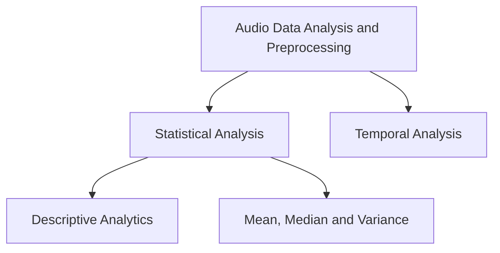

# Audio-Data-Analysis-Techniques

This repository contains data preprocessing and analysis techniques for audio data.

Data used: https://www.kaggle.com/datasets/ejlok1/toronto-emotional-speech-set-tess

  
  
  
  
  
  

### Contributors

